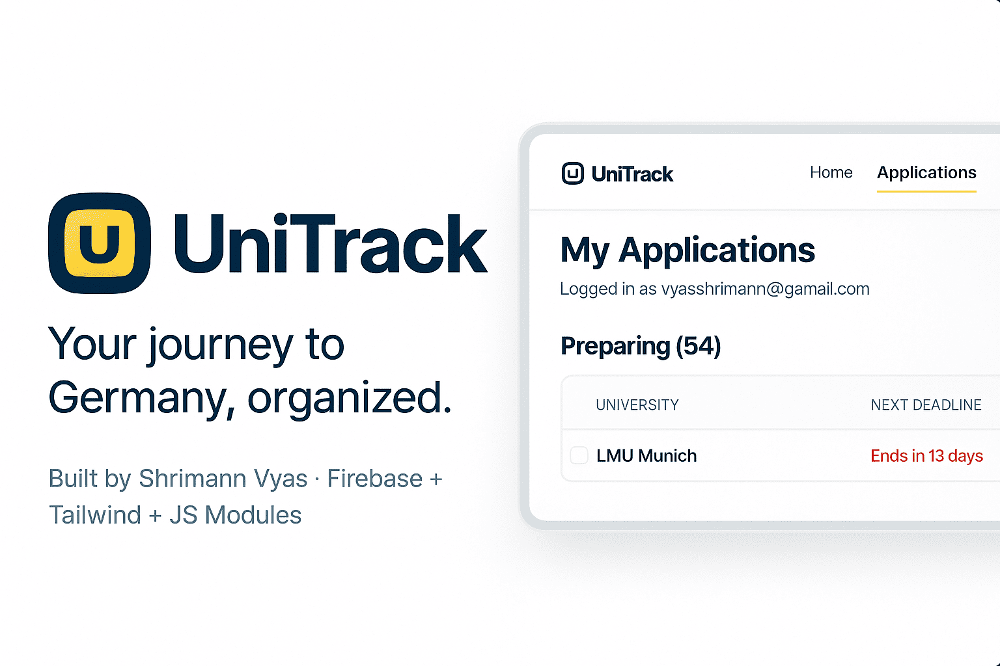

# 🎓 UniTrack — German University Application Tracker



> **Your journey to Germany, organized.**  
> Track, manage, and export your German university applications with ease. Built using Firebase, Tailwind CSS, and modern JavaScript (ES Modules).

---

## 🚀 Live Demo
🔗 **[Try UniTrack on GitHub Pages →](https://shri-man.github.io/UniTrack/)**

---

## ✨ Features

✅ **Secure Firebase Authentication** — Create and manage accounts seamlessly  
✅ **Real-Time Firestore Sync** — Instantly updates your dashboard across devices  
✅ **Smart Deadline System** — Tracks "Starts in / Ends in" days dynamically  
✅ **Application Dashboard** — Grouped by university, expandable views  
✅ **Import/Export Support** — Excel & Word import with SheetJS and docx-preview  
✅ **Wishlist** — Track universities to explore  
✅ **Conflict Handling** — Merge modal for duplicate imports  
✅ **Requirement Notes** — Add or edit course-specific requirements  
✅ **Modern UI** — Built with Tailwind CSS and smooth animations  
✅ **Responsive SPA** — Fully optimized for desktop & mobile

---

## 🧱 Tech Stack

| Layer | Technology |
|:------|:------------|
| **Frontend** | HTML5, Vanilla JS (ES Modules) |
| **Styling** | Tailwind CSS |
| **Backend** | Firebase (Auth + Firestore) |
| **Data Handling** | SheetJS (XLSX), docx-preview |
| **Hosting** | GitHub Pages |
| **Version Control** | Git + GitHub |

---

## 🗂️ Folder Structure

UniTrack/
├── assets/
│ ├── favicon.svg
│ ├── university-preview-banner.png
├── src/
│ ├── alerts.js
│ ├── data.js
│ ├── dates.js
│ ├── dom.js
│ ├── firebase.js
│ ├── importers.js
│ ├── main.js
│ ├── modals.js
│ ├── navigation.js
│ ├── render.js
│ ├── state.js
├── styles.css
├── index.html
├── .gitignore
├── README.md

## ⚙️ Setup & Local Run

**1️⃣ Clone the repository**
```bash
git clone https://github.com/shri-man/UniTrack.git
cd UniTrack
2️⃣ Configure Firebase

Create a Firebase project

Enable Authentication (Email/Password) and Firestore Database

Replace your Firebase config in /src/firebase.js

3️⃣ Run locally
You can use a simple local server (Python, Node, or VS Code Live Server):

# Python
python -m http.server 8080
Then open:
👉 http://localhost:8080

4️⃣ Deploy on GitHub Pages

Push your main branch

Go to Settings → Pages → Deploy from branch → main → / (root)

📦 Dependencies
Firebase JS SDK

Tailwind CSS

SheetJS

🧠 Architecture
Modular JS → Each feature isolated (auth, data, modals, rendering)

Reactive listeners → Firestore onSnapshot() for live updates

Non-blocking UX → Loading spinner + optimistic rendering

Deadline engine → Calculates time windows (start/end) per course

Safety nets → Merge conflict modal, confirm deletion, state cleanup

👨‍💻 Author
Shrimann Vyas
📧 vyasshrimann@gmail.com
🌐 LinkedIn • Portfolio

🏷️ License
MIT License © 2025 Shrimann Vyas

⭐ Support
If you like this project:

Star ⭐ the repo

Share it with your peers applying to German universities

Fork it and build your own version!

“Your journey to Germany, organized.” 🇩🇪
